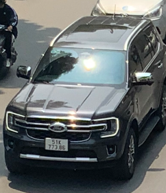
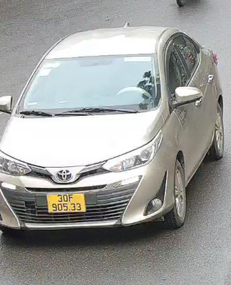
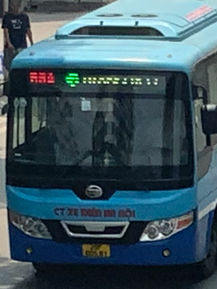
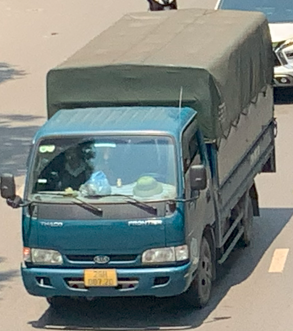
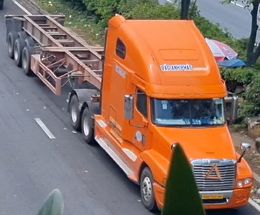
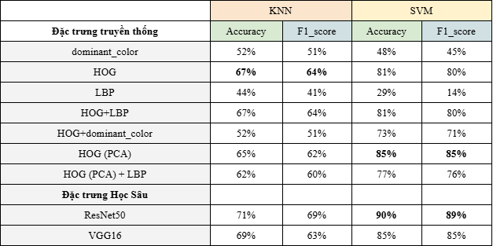

# CS231-Vehicle-Image-Classification

# 📂 Dataset

Link: https://drive.google.com/drive/folders/16uj-Gz9Rv3C0UMOuXRgRRiH27O7LC9HA?usp=sharing

Chúng tôi thu thập dữ liệu xe bốn bánh trên đường phố Việt Nam, sau đó dùng mô hình YOLO đã được huấn luyện sẵn để tách vật thể tự động và gán nhãn vật thể vào một trong năm loại:

+ SUV - Crossover - MPV: Xe gầm cao hoặc minivan, công suất chở người tối đa 16 chỗ.

+ Truck - Half-Truck: Xe tải hoặc bán tải.

+ Bus: Xe chở số lượng lớn hành khách, công suất lớn hơn SUV.

+ Container: Xe kéo rơ moóc hoặc sơ mi rơ moóc chở hàng hóa.

+ Sedan: Xe gầm thấp chở người, tối đa 5 chỗ.

Dưới đây lần lượt là hình minh họa cho 5 nhãn trên:

  

     
    <b>SUV</b>
  

  

     
    <b>Sedan</b>
  

  

     
    <b>Bus</b>
  

  

     
    <b>Truck</b>
  

  

     
    <b>Container</b>
  

# 🔍 Feature Extraction
## 📌 Traditional Extraction
Trong đồ án này, chúng tôi sử dụng các phương pháp chiết xuất đặc trưng truyền thống:

+ HOG (Histogram of Oriented Gradients)

+ Dominant Color

+ Histogram Color

## 🤖 Deep Learning Feature Extraction
Bên cạnh đó, chúng tôi tận dụng các kiến trúc mạng nơ-ron hiện đại:

+ VGG16

+ ResNet50

# 📊Kết quả 
Sau đó chúng tôi sử dụng 2 mô hình học máy là SVM và KNN để đánh giá chất lượng của từng cách chiết xuất đặc trưng

Để đánh giá hiệu năng của các mô hình máy học truyền thống, chúng tôi sử dụng 2 độ đo Accuracy và F1_score, kết quả có được như sau:

  

